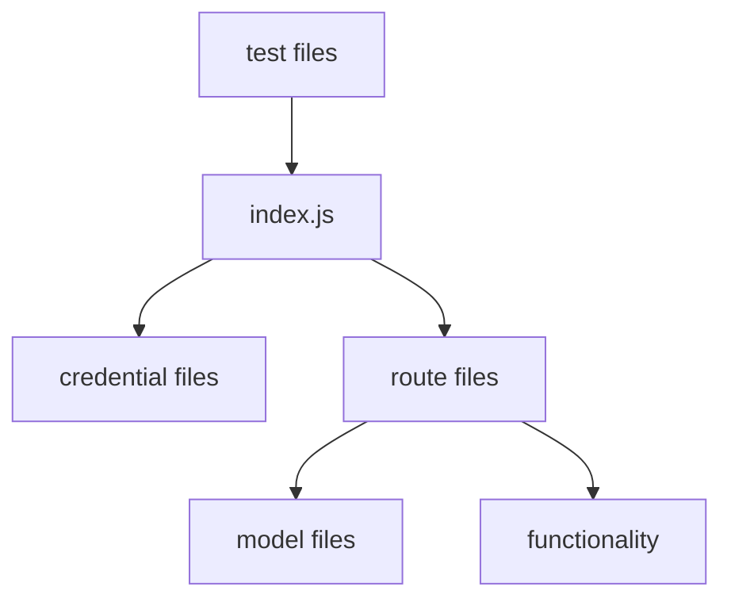
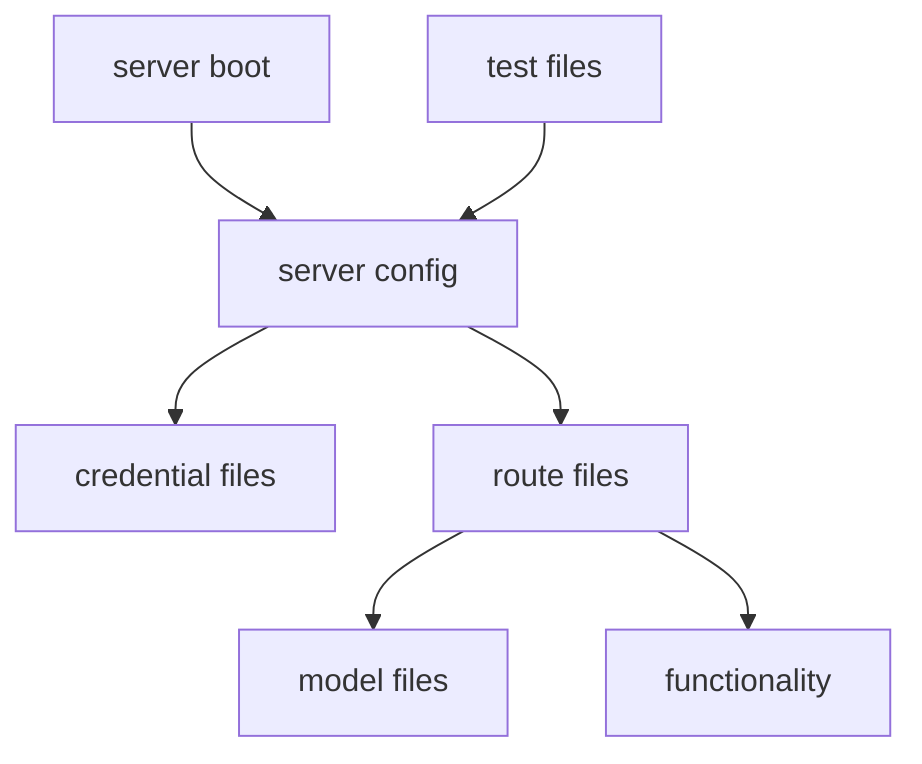

# expressjs-class-oct-22
Basically the lesson plan for the MERN lessons I'm doing at Coder Academy STND-1 March 2022 cohort, taught during October 2022.

> NOTE: This is a big multi-lesson script. It will be a confusing, text-heavy mess unless you've got the lesson recordings to watch while going through these notes.

## Hello World

Before we do too many complex things, let's go through creating an ExpressJS project and setting up some handy tools & tricks that will help our project in the long-term. Let's go!

### Initializing an ExpressJS Project

Initialize your repo as an NPM project with this:

`npm init --y`

Note: "--y" will rush through with default settings, you can change them later if you need to though.

Install ExpressJS into a fresh project with this:

`npm install express --save`

To help with some later security things, it's also a good time to install some security-related packages.

`npm install cors`

`npm install helmet`

CORS helps us configure who should and shouldn't be allowed to access the API. 
Helmet helps protect the API from some older, specific vulnerabilities and ways that bad actors can mis-use the web. 
Even with CORS set up, you should still have Helmet configured - assume that if the apps specified by CORS can be hacked, they may get hacked! So, Helmet is an extra layer of defense on top of your CORS settings.

We can also install `nodemon`, though this will benefit from some setup covered in a later section.

`npm install --save-dev nodemon`

Because this is a dev dependency, use `--save-dev`! This will make sure it doesn't get compiled or bundled into production versions of the app later.


### ExpressJS Architecture 

This app has a specific architecture to help facilitate testing and CICD features.

In a typical ExpressJS app or tutorial, you've probably seen structures like this:



While that's good, that layout is sometimes not great for CICD and other automated things. An `index.js` file in this structure has server configuration _and_ server boot-up contained in the same file -- that "app.listen" that you've probably written once per project and forgotten about. That's not great for anything that needs to import that server _and_ control when that server starts and stops, such as Jest. 

Instead, we need to split the `index.js` into multiple parts.



Basically, the `index.js` file should only start the server. It should not contain any configuration or options or routing or anything else - just import a configured server and start it. 

This is essential for stuff like using Jest in GitHub Actions; if you don't use this architecture, Jest can't close the server properly after testing and it causes GitHub Actions to hang open. That causes issues like broken automation workflows - or worse, high billing costs.

### Creating an ExpressJS Server

Keeping in mind the architecture explained above, we need to make two files: `src/index.js` and `src/server.js`. 

Our `src/index.js` file should look like this, and we'll never need to edit it again:

```javascript
var {app, PORT, HOST} = require('./server');

// Separate the "app.listen" from the rest of the server config & setup.
// This allows us to simplify how the server unit testing is gonna work.
const server = app.listen(PORT, HOST, () => {

	// Handles when the PORT was set to 0, as the server will randomly generate
	// a new number to use if PORT is left as 0.
	if (server.address().port != PORT){
		PORT = server.address().port;
	}

	console.log(`	
	ExpressJS Demo server is now running!
	Server address mapping is:
	
	HOST: ${HOST}
	PORT: ${PORT}
	Congrats!
	`);
})

```

The `src/server.js` file should look like this:

```javascript
const express = require('express');
const app = express();
const cors = require('cors');
const helmet = require('helmet');

// Set values for the server's address
const PORT = process.env.PORT || 0;
const HOST = '0.0.0.0';

// Cool trick for when promises or other complex callstack things are crashing & breaking:
void process.on('unhandledRejection', (reason, p) => {
	console.log(`Things got pretty major here! Big error:\n`+ p);
	console.log(`That error happened because of:\n` + reason);
});

// Configure server security, based on documentation outlined here:
// https://www.npmjs.com/package/helmet
// TLDR: Very niche things from older days of the web can still be used to hack APIs
// but we can block most things with these settings.
app.use(helmet());
app.use(helmet.permittedCrossDomainPolicies());
app.use(helmet.referrerPolicy());
app.use(helmet.contentSecurityPolicy({
	directives:{
		defaultSrc:["'self'"]
	}
}));

// Configure API data receiving & sending
// Assume we always receive and send JSON
app.use(express.json());
app.use(express.urlencoded({extended:true}));

// Configure CORS, add domains to the origin array as needed.
// This is basically where you need to know what your ReactJS app is hosted on.
// eg. React app at localhost:3000 and deployedApp.com can communicate to this API, 
// but a React app at localhost:3001 or SomeRandomWebsite.com can NOT communicate to this API. 
var corsOptions = {
	origin: ["http://localhost:3000", "https://deployedApp.com"],
	optionsSuccessStatus: 200
}
app.use(cors(corsOptions));

// Actual server behaviour
app.get('/', (req, res) => {
	console.log('ExpressJS API homepage received a request.');
  
	const target = process.env.NODE_ENV || 'not yet set';
	res.json({
        'message':`Hello ${target} world!`
    });

});


// Notice that we're not calling app.listen() anywhere in here.
// This file contains just the setup/config of the server,
// so that the server can be used more-simply for things like Jest testing.
// Because everything is bundled into app, 
// we can export that and a few other important variables.
module.exports = {
	app, PORT, HOST
}


```

With that code all in place, you should be able to run your API with this terminal command:

`node src/index.js`

If all goes well, the server will be assigned a random port and start running.


You can then visit it in your browser using `localhost:YourPortNumber`, like so:


Tada! You made an ExpressJS server with robust security and its first route!

### Creating NPM Commands

Because this is a NPM project, we can configure some commands in the project's `package.json` file to help make life easier.

In the `package.json` file's `scripts` section, you can add commands like they're just JSON key-value pairs. Try these commands:

```json

  "scripts": {
    "test": "jest --detectOpenHandles",
    "test-ci": "jest --detectOpenHandles --ci",
    "start": "NODE_ENV=development node src/index.js",
    "start-production": "NODE_ENV=production node src/index.js",
    "start-dev":"PORT=55000 NODE_ENV=development nodemon src/index.js"
  },

```

Your `package.json` file should already have a `scripts` section, so keep in mind what you're adding and where you're adding -- extra commas and other syntactic issues will break the JSON file!

Let's walk through those commands:

- **test**: Basic Jest runner. Nothing fancy, not really intended for major usage.
- **test-ci**: This will be customized later, but it's a way to run Jest in scenarios like GitHub Actions. Super cool, customizable, and we'll add more things to this command soon.
- **start**: Redundant with "start-dev" also existing, but worth showing so you can see the difference between the commands. This sets an environment variable and runs the app via Node.
- **start-production**: Similar to above, but setting the environment variable of "NODE_ENV" to "production". 
- **start-dev**: Similar to above, but specifying a "PORT" so we don't always have to dig through terminal logs to find what the API's current port value is. Also uses `nodemon` to run the app and keep restarting it whenever we save any changes to the API with this command active.

You can run these commands using `npm run CommandNameHere`, like so:


Some super common commands can be run without saying "run", like `npm start`, but most commands need `npm run CommandNameHere`!

## Deployment

Deploy early, deploy often! 

### Heroku Deployment

Heroku is one of the simplest deployment platforms around. If your app runs and is all pushed to GitHub, you can deploy with a couple of clicks! Woo!

> NOTE: Heroku is removing it's simpler free tier after November 28 2022, but overall these steps are going to be unchanged.
>
> Heroku's upcoming Eco Dynos and Mini Postgres tiers (though we won't use Postgres in this lesson), combined with the credit from the GitHub Student pack, equate to a free tier for students anyway.
>
> At the time of this lesson, the plain free tier should still exist so this is a non-issue -- but worth noting for your big final project of the course if it runs into December!

Make sure your ExpressJS app works locally, and then commit your work to GitHub.

That weird trick with the `PORT` we have in our app is really important here -- Heroku will try to assign a random port number through an environment variable, so we need the code we implemented earlier to catch that port number.

Anyway, with our work all pushed to GitHub, here's the process for Heroku deployment:

1. Go to: https://dashboard.heroku.com/
2. Make a new app.
    - Call it whatever you want.
    - Keep its region as whatever it suggested at the start (usually a US region), as most deployment platforms do that to keep costs low.
3. In the app Deploy -> Deployment Method settings, choose "GitHub".
    - Connect your accounts together in the "Connect to GitHub" section.
    - Find your repo and connect it to your Heroku app.
4. Automatic Deploys should be enabled after that - if not, enable it.
    - If no app is deployed immediately, you can either do a manual deploy (just below automatic deploys) or push a new commit to your repo.

Since the Heroku app is always updated whenever you push a new commit to your repo, your deployed app will reflect the latest version of your server. You won't have to do these steps again, just keep committing and pushing your work to GitHub and the deployed site will automatically reflect your work!

A quirk with Heroku and Node: it'll default to running `npm start`. So if we visit our deployed app per this guide, it should be saying "Hello development world!" -- that's not what we want. Some versions of Heroku would just not start at this poitn, and that's okay too - to get around that (or to change the default command to something other than `npm start`), we need to create a `Procfile`.

A `Procfile` is just an instruction file for Heroku or any other deployment platform that uses Procfiles - and it just specifies what to do when the server receives traffic when deployed.

For our app, we need to make sure our Procfile is named `Procfile` (no file extension!!) and has this as its contents:

`web: npm run start-production`

Commit, push, wait for re-deploy - and your app should now reflect the `start-production` command instead!

### Advanced: Google Cloud Run

If you want to mess around with Google Cloud Platform, use some free tier / free credits, learn a bit of Docker syntax, and learn a bit of GitHub Actions - check out this repo: [https://github.com/AlexHolderDeveloper/ServerToCloudRun](https://github.com/AlexHolderDeveloper/ServerToCloudRun)

Note that it _is_ two years old, so things like GitHub Actions package versions and Google Cloud's web UI might've changed. But the overall steps are still valid - my own BigfootDS production stuff is running on this right now! 

Depending on how we go in-class, we may or may not go over this live, together. Probably not if we're short on time as this is very, very optional given how valid Heroku still is as a deployment option. But it's cool extra stuff for those who want to explore it!

## Routing

Routing in ExpressJS needs all custom, do-it-yourself, no generators/scaffolds/etc work. It's fairly straightforward, but you'll have to do a lot of things yourself!

### ExpressJS Route Basics 

Create a `src/Blog/BlogRoutes.js` file and put this code in it:

```javascript
const express = require('express');

// Create a bundle of routes. We'll export this out and then import it into src/index.js.
const routes = express.Router();

// This is the "root" route for the Router instance. 
// Its actual name in the URL will depend on how it's configured in src/index.js
routes.get('/', (request, response) => {

    response.json(`Received a request on ${request.originalUrl}`);
});

// Set up route params with the colon before the name.
routes.get('/:blogID', (request, response) => {

    response.json(`Received a GET request for a blog post with ID of ${request.params.blogID}`);

});

// Use Postman or another HTTP tool to visit a POST route.
routes.post('/:blogID', (request, response) => {

    response.json(`Received a POST request for a blog post with ID of ${request.params.blogID}`);
});

module.exports = routes;

```

In your src/index.js file, add these two lines of code somewhere before your app.listen statement:

```javascript
const importedBlogRouting = require('./Blog/BlogRoutes');
app.use('/blog', importedBlogRouting);
```

Visit your new routes on your app's URL followed by `/blog`, such as `localhost:55000/blog/1234` -- that's routing!

As you can see, the HTTP verbs are just handles on the router. Route parameters are handled with simple syntax. You can chain routes and parameters to - but try that yourself! ;) 

### ExpressJS Data via POST Bodies

Update your postRoutes file so the POST route that uses a param looks like this:

```javascript
// Use Postman or another HTTP tool to visit a POST route.
routes.post('/:blogID', (request, response) => {
    // Cleanly build a response OBJ
    let jsonResponse = {
        message:`Received a POST request for a blog post with ID of ${request.params.blogID}`,
        receivedBody: request.body
    }

    response.json(jsonResponse);
});
```
This part of our src/index.js that we wrote earlier is what will make this data posting work for us:

// Best settings for setting up Express as an API server to receive and process JSON & form data.
app.use(express.json());
app.use(express.urlencoded({extended:true}));
We can submit JSON data, and we can submit "x-www-form-urlencoded" data. Either is fine, both work. Form URL Encoded might take precedence over JSON data, so try not to send both in a single call from your React app!

In Postman, you can make requests like this:

Raw JSON way:


Form Encoded way:


That's pretty much it for routing and sending data via routes - you can absolutely get more-complex with it, but that will depend on your own specific scenarios. You've seen enough here to build route functionality already - and we'll expand on some extra bits with authentication and database content shortly too!


## Authentication

Using Firebase for auth as it has a nice (though potentially long-winded) way of setting of accounts, and supports a huge variety of options.

Go here and make a project (including any accounts you might need to make): [https://console.firebase.google.com/](https://console.firebase.google.com/)

Go to the Authentication page and select "Get started". This may be tucked away in the "Build" tab along the left.

Choose "Email/Password" as your provider for now. Other ones can be set up at any time.

Note: The "Email link" option within "Email/Password" for passwordless sign-in is beyond the scope of this project, don't enable that for now.

Go to your "Project Setings" page -- find the "Project Overview" near the top left of the page and click on the gear icon next to it to find the link to "Project Settings".

On the "Project Settings -> General" section, there should be something about a "Default GCP resource location" having a value of "Not yet selected". Set that to whatever default value it suggests, such as "nam5".

At the bottom of the page, there should be a "Your apps" section. Click on the icon that looks like this `</>`.

Give your app a name - this is internal to Firebase, it has no impact on anything you do that would be user-facing.

Don't enable Firebase Hosting - that's beyond the scope of this guide, and can be enabled later if you want to experiment with it later anyway.

Don't worry about any code or instructions provided after that -- that's for React apps, which doesn't help us in MERN. (The big idea with Firebase is that you can put back-end functionality into front-end apps, which isn't exactly secure and won't meet the requirements of the full-stack assessment either.)

Click through whatever you can (eg. the "Continue to the console" button) to get back to the "Project Settings" page. Click on the "Service Accounts" heading near the top-middle of the page.

The Firebase Admin SDK is what we need to do Firebase things in a back-end application. Install the Firebase Admin SDK into your project with this command: `npm install firebase-admin --save`

While still on the "Project Settings -> Service Accounts" page, in the "Firebase Admin SDK" section, click on "Generate new private key". Save the file somewhere that is NOT within your project / NOT within your git repo. The file should be a JSON file with contents like this:

```json
{
  "type": "service_account",
  "project_id": "firebase project name",
  "private_key_id": "some key ID",
  "private_key": "some private key",
  "client_email": "some email",
  "client_id": "some ID",
  "auth_uri": "some URL",
  "token_uri": "some URL",
  "auth_provider_x509_cert_url": "some URL",
  "client_x509_cert_url": "some URL"
}

```

If it comes with or generates some file ending with "ZoneIdentifier" or similarly-garbled weirdness, delete that ZoneIdentifier file.

To make this easier to set up with regards to our deployment, we're going to set up the Firebase credentials as environment variables. But doing the same trick we did with our NPM scripts for environment variables won't scale well for more and more variables, especially long ones like the private key! We're going to set up a NPM package called `dotenv` to help with this.

Run `npm install dotenv --save` to add `dotenv` to your project.

Create `.env` file in the root of your project. Make sure it's in your `.gitignore` file too!

> If you don't have a `.gitignore` file yet, make one! 
> It should have `.env` on one line and `node_modules/` on another.

Inside your `.env` file, each value should be on its own line. So contents like this is good:

```
FIREBASE_ADMIN_PROJECT_ID=SomeProjectID
FIREBASE_ADMIN_PRIVATE_KEY=BigLongPrivateKeyYay
FIREBASE_ADMIN_CLIENT_EMAIL=SomeProjectEmail

```

The names of the values used in the `.env` file are what we'll need to read back in our ExpressJS app. We need to copy the relevant values from the admin credential JSON file into the `.env` file. 

> A common problem here is that people don't always copy everything, or they copy whatever is on the screen (which isn't enough for the private key when it goes far off of the screen!). 
> Make sure the value you copy is the ENTIRE value within the JSON value quotation marks!

Back in your ExpressJS app's `src/server.js` file, add this code before the routes begin (eg. after CORS, before the first route):

```javascript
// Load up the .env file and store its values into process.env
require('dotenv').config()

// Establish Firebase and give it valid admin credentials
const firebaseAdmin = require('firebase-admin');
firebaseAdmin.initializeApp({
    credential: firebaseAdmin.credential.cert({
        "projectId": process.env.FIREBASE_ADMIN_PROJECT_ID,
        "privateKey": process.env.FIREBASE_ADMIN_PRIVATE_KEY.replace(/\\n/g, '\n'),
        "clientEmail":process.env.FIREBASE_ADMIN_CLIENT_EMAIL
    }),
});

```

...Yeah, there's a weird formatting issue with the private key as far as JSON is concerned. It's weird. But a bit of string find-and-replace magic fixes things!

To help give our auth routes a skeleton (no auth functionality yet!), add this code to your `src/User/UserRoutes.js` file:

```javascript
const express = require('express');

const routes = express.Router();

// Create a user, a session token & a refresh token
routes.post('/sign-up', async (request, response) => {
    // Process posted form/json data
    let newUserDetails = {
        email: request.body.email,
        password: request.body.password,
        displayName: request.body.username
    }
    // Ideally perform validation on those properties before moving on.

    // Hand data to a sign-up function

    // Return error or token as response

});

// Create a session token & refresh token
routes.post('/sign-in', async (request, response) => {
    // Process posted form/json data
    let newUserDetails = {
        email: request.body.email,
        password: request.body.password,
        displayName: request.body.username
    }
    // Ideally perform validation on those properties before moving on.

    // Hand data to a sign-in function

    // Return error or token as response

});

// Create a session token & refresh token
routes.post('/validate-session', async (request, response) => {
    // Process posted form/json data
    let newUserDetails = {
        idToken: request.body.idToken,
        refreshToken: request.body.refreshToken,
    }

    // Hand data to a validation function

    // Return error or token as response

});

module.exports = routes;

```

Those routes won't work just yet, but they should help outline what routes we do need and provide some pseudocode/comments about what we want to do.

Importantly, it should be clear that our ExpressJS is making a fancy JWT or auth token. So our user functionality has three main parts: 

- sign up, to create new users in the system
- sign in, to let users begin working within the system
- validate session, to let users continue working within the system

JWTs and other token-based auth systems typically have an expiration date, meaning that once a user signs in then they're on a time limit before they must sign in again. Since you can absolutely make multiple requests from your frontend simultaneously, you can always send user data to "validate session" when doing other tasks to ensure that the user doesn't get kicked out of the frontend while in the middle of doing stuff.

> TODO: Mermaid diagram about the flow of the token system in-action 
```mermaid


```

We have to jump back to Firebase and set up some _client_ credentials. These are different to the admin credentials that we set up earlier, as so:

- Admin credentials: Manage accounts with admin powers, access whatever data we need whenever we need it. Useful for creating, deleting, or otherwise editing user accounts.
- Client credentials: Act as a user to generate auth tokens (eg. JWT) for identify verification in other actions, such as creating user-specific posts. 

Admins cannot act as users, which means to generate a JWT cleanly we need to use the Firebase client system. It's weird, I know. 

> Firebase is not really meant to be a MERN package - it's a cloud service that replaces backends instead. 
>
> But it's importantly free, easy to use, and easy to customize - so it's worthwhile to hack it to bits and squeeze functionality into apps that need the functionality that Firebase provides.
> 
> It's also a good MongoDB alternative, but that's beyond the scope of the course and won't be allowed in your assessment! 
>
> If you're going to use Firebase in your assessment, you can only use authentication and file storage!

Go back to your Firebase "Project Settings" page, and down in the "Your apps" section select your current app. Select the "Config" option -- you would've used the "npm" option so far. The "Config" option represents the keys that a front-end app would use. The Firebase client library works in the back-end just fine, and will help us by providing additional user functionality alongside the Firebase Admin SDK. It's weird but basically the Admin SDK handles some things that the Client SDK doesn't, and vice versa.

Should be a JavaScript file like this:

```javascript
const firebaseClientConfig = {
  apiKey: "some key",
  authDomain: "some URL",
  projectId: "Firebase project ID",
  storageBucket: "some URL",
  messagingSenderId: "some ID",
  appId: "some Firebase app ID",
  measurementId: "some Google Analytics ID"
};

module.exports = {firebaseClientConfig}

```

Note that your Admin SDK key was a dedicated JSON file turned into some environment variables, while this is just plain JavaScript. Why? Because these credentials are made for usage in the client app (the frontend!) - and anything stored in a client app should be assumed to be accessible by a person using the client app.

So, we can store these in our git history and things should be mostly fine. 

Install the Firebase Client SDK with this command: `npm install firebase`

Then, create a `src/User/UserFunctions.js` file and give it these contents:

```javascript

// Firebase Admin SDK was initialized elsewhere, we just need access to its functions.
const firebaseAdmin = require('firebase-admin');

// Set up the Firebase Client SDK
const {firebaseClientConfig} = require('../../keys/FirebaseClientKey');
const firebaseClient = require("firebase/app");
// Add the Firebase products that you want to use
const {getAuth, signInWithEmailAndPassword} = require ("firebase/auth");
// Initialize the Firebase Client SDK
firebaseClient.initializeApp(firebaseClientConfig);

async function signUpUser(userDetails){
    // Use the Firebase Admin SDK to create the user
    return firebaseAdmin.auth().createUser({
        email: userDetails.email, // User email address.
        emailVerified: true, // Required for fuller user functionality, but a hassle to set up in a short tutorial. Set to false if you do end up configuring email verifications, as the email system will set it to true.
        password: userDetails.password, // password. You'll never see this value even as project admin.
        displayName: userDetails.displayName, // the username
        // photoURL: "", // point to an image file hosted elsewhere
        disabled: false // if a user is banned/usable
    }).then( async (userRecord) => {
        console.log(`\n Raw userRecord is ${JSON.stringify(userRecord)} \n`);
        
        // Set "Custom Claims" on the new user
        let defaultUserClaims = firebaseAdmin.auth().setCustomUserClaims(userRecord.uid, {regularUser: true}).then(() => {
            console.log("Set a regularUser claim to the new user! They must log in again to get the new access.");
            // You can do things like detect values in the email address (eg. if the new user email is the project admin email) and set the claim object to include other values.
            // Claims allow you to handle authorization without ever giving the client any data that they could hack or manipulate.
            // Of course, you can still pass the claims along to the client if you want to (eg. for front-end authorization to hide content), just know that front-end authorization isn't bulletproof.

        });

        return userRecord;
        
    }).catch(error => {
        console.log("Internal sign-up function error is: \n" + error);
        return {error:error};
    });
}

async function signInUser(userDetails){
    const firebaseClientAuth = getAuth();

    let signInResult = signInWithEmailAndPassword(firebaseClientAuth, userDetails.email, userDetails.password)
    .then(async (userCredential) => {

        let userIdToken = await firebaseClientAuth.currentUser.getIdTokenResult(false);

        console.log(`userIdToken obj is\n ${JSON.stringify(userIdToken)}`);

        return {
            idToken: userIdToken.token,
            refreshToken: userCredential.user.refreshToken,
            email: userCredential.user.email,
            emailVerified: userCredential.user.emailVerified,
            displayName: userCredential.user.displayName,
            photoURL: userCredential.user.photoURL,
            uid: userCredential.user.uid
        }
    }).catch(error => {
        console.log("Internal signin function error is: \n" + error);
        return {error:error};
    });

    return signInResult;
}

async function validateUserSession(sessionDetails){
    let userRefreshToken = sessionDetails.refreshToken;
    let userIdToken = sessionDetails.idToken;

    return firebaseAdmin.auth().verifyIdToken(userIdToken, true).then(async (decodedToken) => {

        console.log(`Decoded session token is ${JSON.stringify(decodedToken)}`);

        return {
            isValid: true,
            uid: decodedToken.uid,
            fullDecodedToken: decodedToken
        }
    }).catch((error) => {
        if (error.code == 'auth/id-token-revoked') {
            // Token has been revoked. Inform the user to reauthenticate or signOut() the user.
            console.log("You must sign in again to access this. Full error is: \n" + error);
        } else {
            // Token is invalid.
            console.log("Session token is invalid. Full error is: \n" + error);
        }
          
        return {error:error};
    });
}


module.exports = {
    signUpUser, signInUser, validateUserSession
}

```

Commit and push your work again to see how things work on the live deployed app. 

And remember to use Postman or another network request tool to test out non-GET routes!

