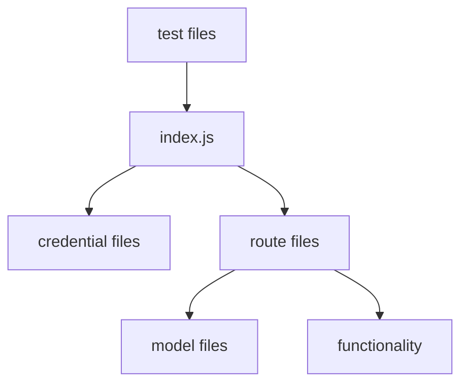
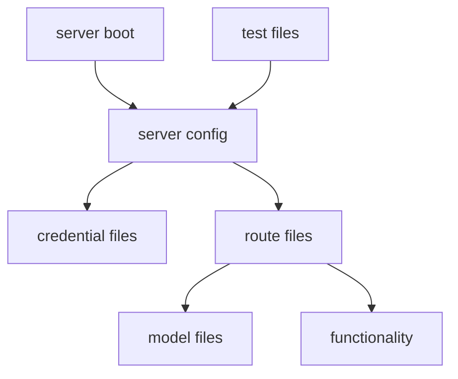
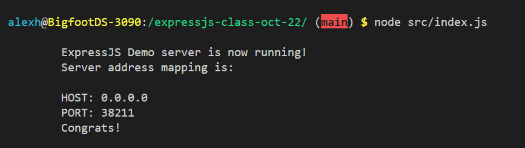
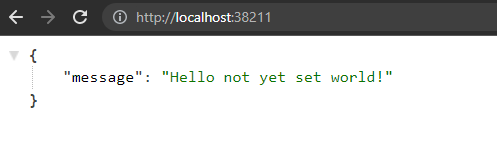
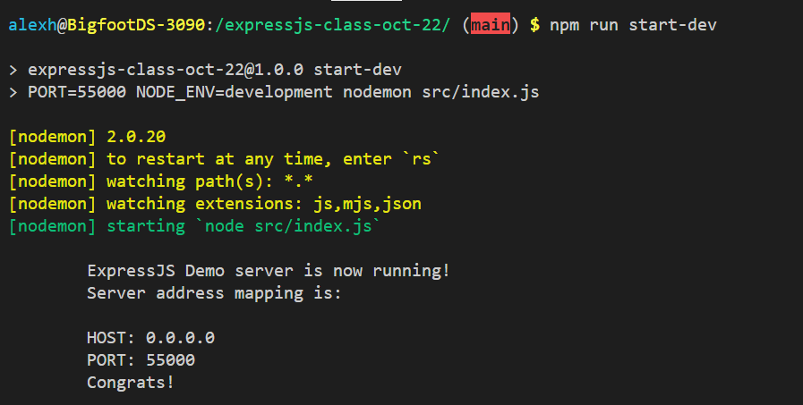

# expressjs-class-oct-22
Basically the lesson plan for the MERN lessons I'm doing at Coder Academy STND-1 March 2022 cohort, taught during October 2022.

> NOTE: This is a big multi-lesson script. It will be a confusing, text-heavy mess unless you've got the lesson recordings to watch while going through these notes.

## Hello World

Before we do too many complex things, let's go through creating an ExpressJS project and setting up some handy tools & tricks that will help our project in the long-term. Let's go!

### Initializing an ExpressJS Project

Initialize your repo as an NPM project with this:

`npm init --y`

Note: "--y" will rush through with default settings, you can change them later if you need to though.

Install ExpressJS into a fresh project with this:

`npm install express --save`

To help with some later security things, it's also a good time to install some security-related packages.

`npm install cors`

`npm install helmet`

CORS helps us configure who should and shouldn't be allowed to access the API. 
Helmet helps protect the API from some older, specific vulnerabilities and ways that bad actors can mis-use the web. 
Even with CORS set up, you should still have Helmet configured - assume that if the apps specified by CORS can be hacked, they may get hacked! So, Helmet is an extra layer of defense on top of your CORS settings.

We can also install `nodemon`, though this will benefit from some setup covered in a later section.

`npm install --save-dev nodemon`

Because this is a dev dependency, use `--save-dev`! This will make sure it doesn't get compiled or bundled into production versions of the app later.


### ExpressJS Architecture 

This app has a specific architecture to help facilitate testing and CICD features.

In a typical ExpressJS app or tutorial, you've probably seen structures like this:



While that's good, that layout is sometimes not great for CICD and other automated things. An `index.js` file in this structure has server configuration _and_ server boot-up contained in the same file -- that "app.listen" that you've probably written once per project and forgotten about. That's not great for anything that needs to import that server _and_ control when that server starts and stops, such as Jest. 

Instead, we need to split the `index.js` into multiple parts.



Basically, the `index.js` file should only start the server. It should not contain any configuration or options or routing or anything else - just import a configured server and start it. 

This is essential for stuff like using Jest in GitHub Actions; if you don't use this architecture, Jest can't close the server properly after testing and it causes GitHub Actions to hang open. That causes issues like broken automation workflows - or worse, high billing costs.

### Creating an ExpressJS Server

Keeping in mind the architecture explained above, we need to make two files: `src/index.js` and `src/server.js`. 

Our `src/index.js` file should look like this, and we'll never need to edit it again:

```javascript
var {app, PORT, HOST} = require('./server');

// Separate the "app.listen" from the rest of the server config & setup.
// This allows us to simplify how the server unit testing is gonna work.
const server = app.listen(PORT, HOST, () => {

	// Handles when the PORT was set to 0, as the server will randomly generate
	// a new number to use if PORT is left as 0.
	if (server.address().port != PORT){
		PORT = server.address().port;
	}

	console.log(`	
	ExpressJS Demo server is now running!
	Server address mapping is:
	
	HOST: ${HOST}
	PORT: ${PORT}
	Congrats!
	`);
})

```

The `src/server.js` file should look like this:

```javascript
const express = require('express');
const app = express();
const cors = require('cors');
const helmet = require('helmet');

// Set values for the server's address
const PORT = process.env.PORT || 0;
const HOST = '0.0.0.0';

// Cool trick for when promises or other complex callstack things are crashing & breaking:
void process.on('unhandledRejection', (reason, p) => {
	console.log(`Things got pretty major here! Big error:\n`+ p);
	console.log(`That error happened because of:\n` + reason);
});

// Configure server security, based on documentation outlined here:
// https://www.npmjs.com/package/helmet
// TLDR: Very niche things from older days of the web can still be used to hack APIs
// but we can block most things with these settings.
app.use(helmet());
app.use(helmet.permittedCrossDomainPolicies());
app.use(helmet.referrerPolicy());
app.use(helmet.contentSecurityPolicy({
	directives:{
		defaultSrc:["'self'"]
	}
}));

// Configure API data receiving & sending
// Assume we always receive and send JSON
app.use(express.json());
app.use(express.urlencoded({extended:true}));

// Configure CORS, add domains to the origin array as needed.
// This is basically where you need to know what your ReactJS app is hosted on.
// eg. React app at localhost:3000 and deployedApp.com can communicate to this API, 
// but a React app at localhost:3001 or SomeRandomWebsite.com can NOT communicate to this API. 
var corsOptions = {
	origin: ["http://localhost:3000", "https://deployedApp.com"],
	optionsSuccessStatus: 200
}
app.use(cors(corsOptions));

// Actual server behaviour
app.get('/', (req, res) => {
	console.log('ExpressJS API homepage received a request.');
  
	const target = process.env.NODE_ENV || 'not yet set';
	res.json({
        'message':`Hello ${target} world!`
    });

});


// Notice that we're not calling app.listen() anywhere in here.
// This file contains just the setup/config of the server,
// so that the server can be used more-simply for things like Jest testing.
// Because everything is bundled into app, 
// we can export that and a few other important variables.
module.exports = {
	app, PORT, HOST
}


```

With that code all in place, you should be able to run your API with this terminal command:

`node src/index.js`

If all goes well, the server will be assigned a random port and start running.



You can then visit it in your browser using `localhost:YourPortNumber`, like so:



Tada! You made an ExpressJS server with robust security and its first route!

### Creating NPM Commands

Because this is a NPM project, we can configure some commands in the project's `package.json` file to help make life easier.

In the `package.json` file's `scripts` section, you can add commands like they're just JSON key-value pairs. Try these commands:

```json

  "scripts": {
    "test": "jest --detectOpenHandles",
    "test-ci": "jest --detectOpenHandles --ci",
    "start": "NODE_ENV=development node src/index.js",
    "start-production": "NODE_ENV=production node src/index.js",
    "start-dev":"PORT=55000 NODE_ENV=development nodemon src/index.js"
  },

```

Your `package.json` file should already have a `scripts` section, so keep in mind what you're adding and where you're adding -- extra commas and other syntactic issues will break the JSON file!

Let's walk through those commands:

- **test**: Basic Jest runner. Nothing fancy, not really intended for major usage.
- **test-ci**: This will be customized later, but it's a way to run Jest in scenarios like GitHub Actions. Super cool, customizable, and we'll add more things to this command soon.
- **start**: Redundant with "start-dev" also existing, but worth showing so you can see the difference between the commands. This sets an environment variable and runs the app via Node.
- **start-production**: Similar to above, but setting the environment variable of "NODE_ENV" to "production". 
- **start-dev**: Similar to above, but specifying a "PORT" so we don't always have to dig through terminal logs to find what the API's current port value is. Also uses `nodemon` to run the app and keep restarting it whenever we save any changes to the API with this command active.

You can run these commands using `npm run CommandNameHere`, like so:



Some super common commands can be run without saying "run", like `npm start`, but most commands need `npm run CommandNameHere`!

## Deployment

Deploy early, deploy often! 

### Heroku Deployment

Heroku is one of the simplest deployment platforms around. If your app runs and is all pushed to GitHub, you can deploy with a couple of clicks! Woo!

> NOTE: Heroku is removing it's simpler free tier after November 28 2022, but overall these steps are going to be unchanged.
>
> Heroku's upcoming Eco Dynos and Mini Postgres tiers (though we won't use Postgres in this lesson), combined with the credit from the GitHub Student pack, equate to a free tier for students anyway.
>
> At the time of this lesson, the plain free tier should still exist so this is a non-issue -- but worth noting for your big final project of the course if it runs into December!


Make sure your ExpressJS app works locally, and then commit your work to GitHub.

That weird trick with the `PORT` we have in our app is really important here -- Heroku will try to assign a random port number through an environment variable, so we need the code we implemented earlier to catch that port number.

Anyway, with our work all pushed to GitHub, here's the process for Heroku deployment:

1. Go to: https://dashboard.heroku.com/
2. Make a new app.
3. In the app Deploy -> Deployment Method settings, choose "GitHub".
4. Automatic Deploys should be enabled after that - if not, enable it.
    - If no app is deployed immediately, you can either do a manual deploy (just below automatic deploys) or push a new commit to your repo.

Since the Heroku app is always updated whenever you push a new commit to your repo, your deployed app will reflect the latest version of your server. You won't have to do these steps again, just keep committing and pushing your work to GitHub and the deployed site will automatically reflect your work!